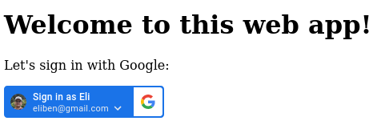
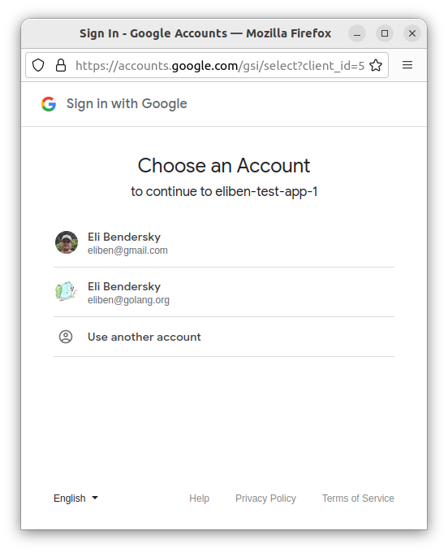

### Sign-in with Google Identity Service (GIS) OIDC
---

This code was modified from Eli Bendersky's https://eli.thegreenplace.net/2024/sign-in-with-google-in-go/

The content of this Readme.md is from that article, as well as Eli Bendersky's https://eli.thegreenplace.net/2023/sign-in-with-github-in-go/
and Salmaan Rashid's https://web.archive.org/web/20191216174622/https://medium.com/google-cloud/authenticating-using-google-openid-connect-tokens-e7675051213b

---

When a user browser connects to our app, we are going to authenticate to Google, then use service credentials to verify whether that authenticated user is part of a 
Google email group, if so, we will store the user's OIDC idtoken as a cookie and redirect onto our web app that will use gRPC to communicate. 

For every subsequent HTTP2 request, the browser will pass that idtoken.

### Login, in general

It's common to see web applications that let you log in through third-party services. "Sign in with Google" is particularly popular; on developer-oriented websites, "Sign in with Google ( or GitHub)" also pops up quite a bit. I want to briefly explore OAuth - the technology that enables these delegated logins.

A note about authentication terminology:

*   Authentication (authn): is the process of verifying the identity of a user or entity. It answers the question, "Who are you?", typically through credentials like usernames and passwords, 2FA etc.

*   Authorization (authz): is the process of determining what permissions an authenticated user has with a given service (e.g. Editor, Commenter or Viewer on Google Documents).

Sign-In is about authn, though Google / GitHub really provides a more general authz mechanism. In Google / GitHub, when you attempt to use OAuth login, you ask for specific permissions (called "scopes") ahead of time; so a user authentication process combines authn (does this user have a valid Google / GitHub account?) with authz (can this app get the following permissions to the user's account?)

We are focussed only on authn though, not asking Google / GitHub for any particular permissions other than verifying that a user has an account and getting some basic user information (email) that can be used to uniquely identify the user in our application.

### OIDC id_token vs OAuth2 access token

More and more Services that _\_you\__ deploy on Google Cloud can have automatic perimeter authentication enabled by default. What I mean by that is you can now deploy a Cloud Function or Cloud Run instance and automatically enforce IAM policies that allow only certain identities through that you allow. These clients that access your service must present a Google Issued [OpenID Connect token](https://web.archive.org/web/20191216174622/https://openid.net/specs/openid-connect-core-1_0.html#IDToken).

This section covers authenticating against security perimeters which requires clients to present valid [OpenID Connect tokens](https://web.archive.org/web/20191216174622/https://openid.net/specs/openid-connect-core-1_0.html#IDToken). These security perimeters do not protect Google APIs but your services deployed behind certain Google Cloud Products. For example, if you deploy to [Cloud Functions](https://web.archive.org/web/20191216174622/https://cloud.google.com/functions/docs/) or an application on [Cloud Run](https://web.archive.org/web/20191216174622/https://cloud.google.com/run/docs/), you can enable a perimeter such that any client that wants to invoke the function or your application must present an ID token issued by Google.

These tokens are not OAuth2 [access\_tokens](https://web.archive.org/web/20191216174622/https://developers.google.com/identity/protocols/OAuth2) you would use to call a Google Service or API directly such as a Google Compute Engine API or Cloud Storage Bucket but `id_tokens` that assert identity and are signed by Google.

What is an id\_token?
=====================

[OpenID Connect](https://en.wikipedia.org/wiki/OpenID) is an authentication protocol built on top of OAuth 2.

OpenIDConnect (OIDC) tokens are signed JSON Web Tokens [JWT](https://web.archive.org/web/20191216174622/https://tools.ietf.org/html/rfc7519) used to assert identity and do not necessarily carry any implicit authorization against a resource. These tokens will just declare who the caller is and any service that the token is sent to can verify the token’s integrity by verifying the signature payload provided with the JWT. For more information, see the links in the [References](https://web.archive.org/web/20191216174622/https://github.com/salrashid123/salrashid123.github.io/tree/master/google_id_token#references) section below

If the ID Token is signed and issued by Google, that token can be used as a token against GCP service perimeters because the service can decode the token, verify its signature, and finally identify the caller using values within the JWT claim. For example, the JWT header and payload below describe a token that was issued by Google (`"iss": "https://accounts.google.com"`), identifies the caller (`"email": "svc_account@.project.gserviceaccount.com"`), has not expired (the service will check the `exp:` field), and finally will verify the JWT is intended for the service or not to `"aud": "https://example.com"`.

```
{
    "alg": "RS256",
    "kid": "5d887f26ce32577c4b5a8a1e1a52e19d301f8181",
    "typ": "JWT"
}.{
    "aud": "https://example.com",
    "azp": "107145139691231222712",
    "email": "svc_account@.project.gserviceaccount.com",
    "email_verified": true,
    "exp": 1556665461,
    "iat": 1556661861,
    "iss": "https://accounts.google.com",
    "sub": "107145139691231222712"
}
```

> _Note: the subject (_`sub`_) claim in the token above represents the unique internal Google identifier account representing the ID Token._

What's an Audience?
===================

The `aud:` field describes the service name this token was created to invoke. If a service receives an id\_token, it must verify its integrity (signature), validity (is it expired), and if the aud: field is the predefined name it expects to see. If the names do not match, the service should reject the token as it could be a replay intended for another system.

Both Google [Service Accounts](https://web.archive.org/web/20191216174622/https://cloud.google.com/iam/docs/service-accounts) and Users can get id\_tokens but with an important distinction: User login OAuth flows issue id\_tokens statically bound to the web or oauth2 client\_id the flow as associated with. That is if a user logs into a web application involving oauth2, the id\_token that the provider issues to the browser will have the aud: field bound to the oauth2 client\_id.

Service Accounts, on the other hand, can participate in a flow where they can receive an `id_token` from Google with an `aud:` field it specified earlier. These token types issued by Service Accounts are generally the ones discussed in this article.

A brief overview of OAuth2
-------------------------

OAuth is an authorization standard; currently in version 2.0, it's formally described in [RFC 6750](https://datatracker.ietf.org/doc/html/rfc6750). In this post I'll only provide a brief introduction to the standard in the context of the Google / GitHub authentication flow I'm describing; I recommend reading more - start with the [Wikipedia page](https://en.wikipedia.org/wiki/OAuth) and follow links from there as needed.

Here's a useful diagram describing the OAuth 2.0 (it's taken from [this post by Digital Ocean](https://www.digitalocean.com/community/tutorials/an-introduction-to-oauth-2), which is also a good introduction to the subject):


When we want to provide a "Sign-in with Google (or GitHub)" in our application, the actors involved in the diagram are:

*   Application (or client): is our application - a web app that wants to allow users to log in with their Google / GitHub account rather than (or in addition to) implementing its own authentication flow.

*   User: wants to log into our app, and has a Google / GitHub account.

*   User-agent: the user's web browser

*   Auth Server: the Google / GitHub OAuth authorization server


The steps involved are:

1.  The user visits the application's website and chooses to log in with Google / GitHub credentials. The application redirects the user to the Google / GitHub auth server which notifies them that "Application FOO" wants them to log in.

2.  The user logs into Google / GitHub; note that this is happening on Google / GitHub's website, in a secured HTTPS session vs. GitHub's server. The user enters their email, password and 2FA if required.

3.  If the login is successful, the auth server redirects the user's browser back to the application, and provides the application with a temporary code it can use to ask for access tokens.

4.  The application uses the temporary code from Google / GitHub along with a secret it has pre-registered with Google / GitHub to request an access token to the user's account.

5.  Google / GitHub checks that everything is kosher and provides an access token to the application.

From this stage on, the application can use the token to query the Google / GitHub API on behalf of the logged-in user, based on the permissions (or "scopes") the user agreed to provide to the application [\[1\]](https://eli.thegreenplace.net/2023/sign-in-with-github-in-go/#footnote-1). For logging in, the application just needs to know what the user's email address is.

One important aspect to understand about OAuth for web applications is that it leverages HTTP redirection (status code 301) to route the user between the different servers involved. This is important for user control, security and also convenience (for example, it allows us to register `localhost` endpoints with Google / GitHub for testing). The way it works is that in step (1) when our application sends the user to Google / GitHub, it adds a redirection URL for Google / GitHub in a request parameter; Google / GitHub uses this to redirect the user back to our page in step (3). We'll see this in action soon.

---
### JWT Cookies
Storing JWT (JSON Web Token) in a cookie is considered safer than storing it in session storage or local storage for several reasons:

1. Cookies are less vulnerable to Cross-Site Scripting (XSS) attacks than session storage or local storage. XSS attacks occur when a malicious script is injected into a website and can access and manipulate data stored in the user’s browser. Since cookies have an extra layer of security in the form of the HttpOnly flag, they cannot be accessed by JavaScript code, which reduces the risk of XSS attacks.
2. Cookies can be configured to have an expiration time, after which they are automatically deleted from the user’s browser. This means that if an attacker gains access to the JWT stored in a cookie, the token will only be valid for a limited time, reducing the risk of long-term damage.
3. Cookies can be configured to be sent only over HTTPS, which provides encryption and authentication of the data being transmitted. This reduces the risk of man-in-the-middle attacks, where an attacker intercepts and modifies the data being transmitted between the user’s browser and the server.
4. Session storage and local storage are more vulnerable to Cross-Site Request Forgery (CSRF) attacks than cookies. CSRF attacks occur when an attacker sends a request from a user’s browser without their knowledge or consent. Since session storage and local storage are accessible by JavaScript code, an attacker can easily read and send the JWT token from these storage mechanisms, whereas cookies are less vulnerable to these types of attacks.
5. In summary, storing JWT in a cookie with the HttpOnly flag and an expiration time is considered safer than storing it in session storage or local storage. However, it’s important to note that cookies are not immune to attacks, and other security measures such as input validation, access control, and rate limiting should also be implemented to ensure the overall security of the application.

Using Google Identity Service (GIS)
-----------------------------------

The currently recommended way to implement sign-in with Google is using the [Google Identity Service client library](https://developers.google.com/identity/gsi/web/guides/overview). There's a lot of documentation on that page, and it's worth reading through.

Using this approach, we'll get a standard looking button:



When clicked, a popup opens with a standard-looking Google account selection:



There's also an option for "one tap" which surfaces the currently logged in Google user in an in-page popup to click (this also works well on mobile!)

To get started, you'll need to register an application at [https://console.cloud.google.com/apis/credentials](https://console.cloud.google.com/apis/credentials) and obtain a client ID and secret (the secret isn't used for this approach, but is needed for the next one).

1. Open Google APIs console, Click on the `Credentials` page.
2. Click `Create Credentials` > `OAuth client ID`. Select the `Applicatio`n type as `Web Application` and add the name of the `Application`. For this tutorial, I've entered the `Application` as `Go-Auth2` .
3. Click `ADD URI` under `Authorized JavaScript origins` and add http://localhost:8080 .
4. Click `ADD URI` under `Authorized redirect URIs` and add http://localhost:8080/google/callback .
5. Copy the `Client Credentials` Displayed.

We'll use a Google-provided JS client library called GSI which we include in our web page; it implements the actual button and all the client-side handling

This is it! I like how all the complicated front-end details are handled by Google's own JS library; there's a lot of potential nuance there with one-tap and automatic sign-in, different UI requirements for desktop browsers and mobile, etc. If you're developing a standard web-app, this definitely seems like the way to go.
